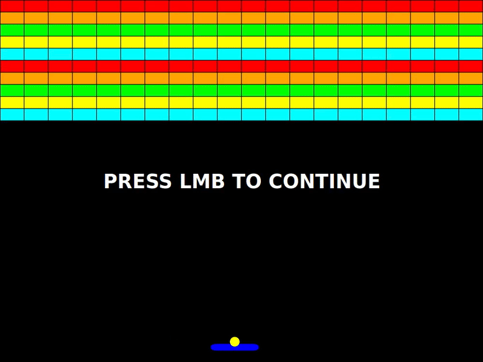

# Breakout
C++ implementation of classic Breakout game using Qt 6.2.4 library.

**Windows and Linux executables are provided.**

# How to run on Linux
1. Download release zip from:\
https://github.com/adam-choragwicki/Breakout_Game_Qt_Cplusplus/releases/latest/download/executable_linux.zip
2. Unzip
3. Run **executable_linux/Breakout.sh**

**OR**

1. Clone repository and run **Breakout.sh**

# How to run on Windows
1. Download release zip from:\
https://github.com/adam-choragwicki/Breakout_Game_Qt_Cplusplus/releases/latest/download/executable_windows.zip
2. Unzip
3. Run **executable_linux/Breakout.exe**

**OR**

1. Clone repository and run **Breakout.bat**
